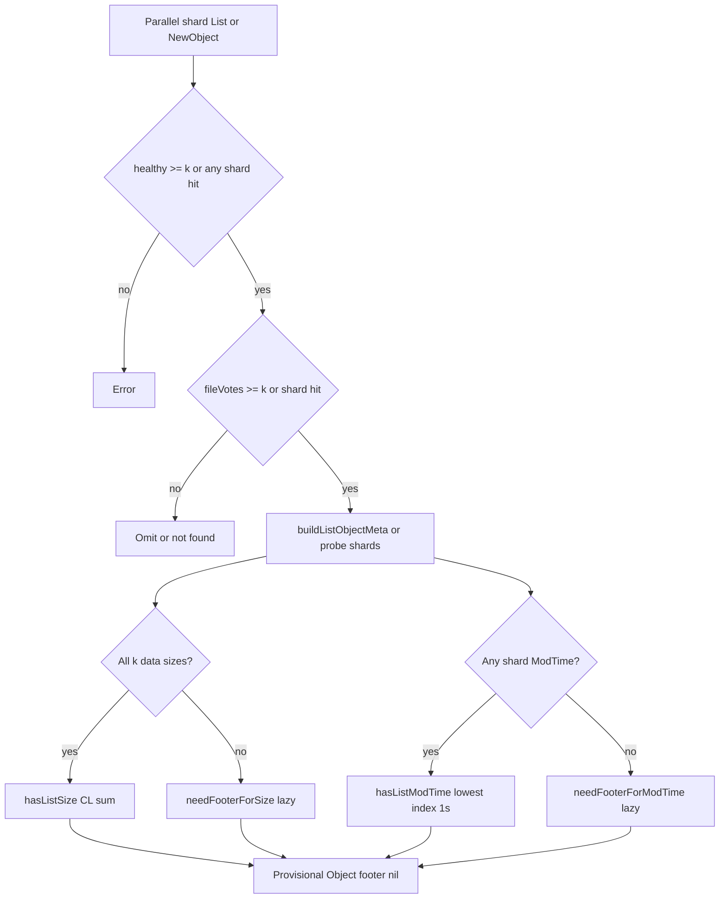

# RS listing and object metadata

**Audience:** implementers and reviewers.  
**User-facing summary:** [`docs/content/rs.md`](../../../docs/content/rs.md) (Listing and Metadata sections).  
**Code:** [`list.go`](../list.go), [`list_metadata.go`](../list_metadata.go), [`object.go`](../object.go).  
**Tests:** [`list_metadata_test.go`](../list_metadata_test.go), [`rs_test.go`](../rs_test.go).  
**Last updated:** 2026-06-10

## Overview

`Fs.List`, `Fs.NewObject`, and server-side **`Copy`/`Move`** return `*Object` entries with
**provisional** size/ModTime when shard remotes expose enough metadata — **without** reading an
RS footer on the hot path.

Goals:

- Avoid per-file `readFooterFromParticle` on list, sync/check `NewObject`, and copy/move return
  when virtual-padding sizes and shard ModTimes are available.
- Keep listing consistent with Reed–Solomon reconstructability (**k** shards).
- Leave writes and namespace mutations on **`write_quorum`** (default **k+1**).

## Metadata authority (normative)

### Size

| Source | When authoritative for `Size()` |
|--------|----------------------------------|
| **k data-shard remote sizes** | All data shards `0..k−1` list/hold the object with `size >= FooterSize` → virtual-padding sum. **Always**, including after `Open`/`Hash` loads a footer. |
| **Footer `ContentLength`** | Only when the k-data-shard path did not resolve (parity-only votes, missing data shard, invalid sizes). Lazy-loaded via `ensureFooterForSize`. |

### ModTime

| Source | When authoritative for `ModTime()` |
|--------|-------------------------------------|
| **Shard remote ModTime** | Backend `Precision() != ModTimeNotSupported`. Lowest shard index among shards with object + ModTime; truncated to **1s**. **Always**, including after `Open`/`Hash`. |
| **Footer `Mtime`** | Only when no shard exposes ModTime (`ModTimeNotSupported` or none present). Lazy-loaded via `ensureFooterForModTime`. |

Footer `Mtime` is still written at **Put** / heal encode time (nanoseconds) for
`ModTimeNotSupported` backends and heal reference; it is **not** authoritative on
ModTime-capable backends after a cheap `SetModTime`.

### Open / Hash

`Open` and `Hash` require a footer for stripe layout and digests (`ensureFooter`). Loaded
footer does **not** override successful k-data-shard size or shard-remote ModTime for
`Size()` / `ModTime()`.

## Read vs write quorum

| Layer | Threshold | Notes |
|-------|-----------|-------|
| Directory listing | `healthy >= k` | Shards that listed the dir successfully (or `ErrorDirNotFound`) |
| File name vote | `fileVotes >= k` | Shards that listed the name as a **file** |
| Directory name vote | `dirVotes >= k` | Shards that listed the name as a **directory** |
| Broken file | `fileVotes < k` | Omit from output; log; **no** footer read |
| Write path | `write_quorum` (default **k+1**) | Put, Remove, SetModTime, Copy/Move/DirMove, mkdir/rmdir, … |
| Degraded / healthy | `present_shards >= k` | `backend degraded` inspection |

## List pipeline

1. **Parallel shard `List`** — [`list.go`](../list.go).
2. **Vote merge** — per remote: `fileVotes`, `dirVotes`, per-shard file flags, sizes, ModTimes.
3. **Directory gate** — `healthy < k` → error.
4. **Per-name resolution** — sorted remote names:
   - type conflict → log, omit unless one side reaches quorum
   - `fileVotes < k` → log broken, omit
   - `fileVotes >= k` → [`buildListObjectMeta`](../list_metadata.go) →
     [`newObjectFromListMetadata`](../list_metadata.go) (**no eager footer**)
   - `dirVotes >= k` → `fs.NewDir`

## Size resolution

```text
CL = Σ(i=0..k−1) (listParticleSize_i − FooterSize)
```

Implemented in [`resolveListSize`](../list_metadata.go) →
[`ContentLengthFromDataShardPayloads`](../payloadlayout.go).

| Condition | Result |
|-----------|--------|
| All **k** data shards list the file with `size >= FooterSize` | `hasListSize = true`; **no** footer on list |
| `fileVotes >= k` but any data shard missing or size too small | `needFooterForSize`; `Size()` lazy-loads one footer |
| `fileVotes < k` | Object **omitted** |

## ModTime resolution

| Layer | Behavior |
|-------|----------|
| **Put** | Truncated source ModTime in shard `ObjectInfo` + footer `Mtime` (ns) at encode |
| **List / NewObject (provisional)** | Per-shard ModTime truncated to **1s** in [`recordShardFileEntry`](../list_metadata.go) |
| **Pick** | [`resolveListModTime`](../list_metadata.go): lowest shard index with ModTime |
| **Skew** | Times differing by **> 1s** → `fs.Logf` warning; still lowest index |
| **Unavailable** | `needFooterForModTime`; `ModTime()` lazy-loads one footer |
| **After Open / Hash** | Shard remote ModTime still wins when backends support it |

Mtime skew alone does **not** force a footer read.

## Lazy footer loading

[`newObjectFromListMetadata`](../list_metadata.go) returns provisional fields only
(`footer == nil`). [`Object.Size`](../object.go) / [`Object.ModTime`](../object.go) call
`ensureFooterForSize` / `ensureFooterForModTime` only when list/probe metadata did not
resolve. [`ensureFooter`](../object.go) is reserved for `Open`/`Hash`.

Provisional fields: `hasListSize`, `listSize`, `hasListModTime`, `listModTime`,
`primaryIndex` (lowest listing/probe shard).

## `NewObject` (direct lookup)

[`NewObject`](../list.go) mirrors the list fast path:

1. Parallel shard `NewObject` — record particle size + ModTime (if supported).
2. If `resolveListSize` **and** `resolveListModTime` succeed → return `*Object` with
   provisional metadata, **no footer**.
3. Else read **one** footer on the lowest shard with a valid particle (fallback).
4. If only size resolves (no ModTime and no footer) → return provisional object; ModTime
   lazy-loads later. Size-only without valid particles → `ErrorObjectNotFound`.

## `SetModTime`

[`Object.SetModTime`](../object.go) uses quorum transactions:

- **ModTime-capable shard:** `Object.SetModTime` at 1s (no payload read).
- **`ModTimeNotSupported` shard:** [`updateShardFooterMtime`](../object.go) (footer rewrite;
  may `ReadAll` payload — see OPEN_QUESTIONS Q7).

On commit, in-memory `listModTime` is updated. Footer `Mtime` on ModTime-capable shards may
remain stale until heal; logical `ModTime()` reads shard remotes per authority table above.

See [`QUORUM_TRANSACTIONS.md`](QUORUM_TRANSACTIONS.md) (SetModTime).

## `Copy` / `Move` return path

After quorum server-side copy/move, [`newObjectAfterCopyMove`](../object.go) returns a
provisional destination `*Object` using **source** logical size/ModTime — no destination
footer read. Correct when shard backends preserve ModTime on copy (local, MinIO). See
OPEN_QUESTIONS Q14 for S3 caveats.

## Heal reference ModTime

When rebuilding missing shard particles, [`resolveHealReferenceModTime`](../list_metadata.go)
picks ModTime from surviving shard **remotes** (same lowest-index rule); footer on a present
shard only if ModTime is unsupported. [`putHealedMissingShards`](../commands.go) applies that
time to healed shard `ObjectInfo` and footer `Mtime`.

## Decision flow



## Worked examples

**Listed at k, size + ModTime from list (fast path)**  
`k=3`, all data shards list `fast.bin` with correct sizes → `List` returns object with
`footer == nil`. (`TestListMetadataFastPathNoFooter`)

**Listed at k, lazy footer for size**  
`k=3`, data shard 0 missing, parity shards list the name → object listed; `Size()` loads
footer once. (`TestListMetadataFooterFallbackMissingDataShard`)

**NewObject fast path**  
Same metadata rules as list without prior `List` call. (`TestNewObjectMetadataFastPathNoFooter`)

**Remote wins over footer after Open**  
`ModTime()` / `Size()` keep list/probe values when footer is loaded for `Open`.
(`TestModTimeAfterOpenPrefersListOverFooter`, `TestSizePrefersRemoteOverFooter`)

**SetModTime on ModTime-capable shards**  
Shard remote updated; footer `Mtime` unchanged. (`TestSetModTimeUpdatesShardRemotes`)

**Heal after cheap SetModTime**  
Rebuilt shard gets reference remote ModTime in both remote and footer.
(`TestHealUsesReferenceShardModTime`)

## Related docs

- Virtual padding: [`payloadlayout.go`](../payloadlayout.go), [`rs.md`](../../../docs/content/rs.md)
- Quorum writes: [`QUORUM_TRANSACTIONS.md`](QUORUM_TRANSACTIONS.md)
- Open follow-ups: [`OPEN_QUESTIONS.md`](OPEN_QUESTIONS.md) (Q6, Q7, Q14, Q17)
