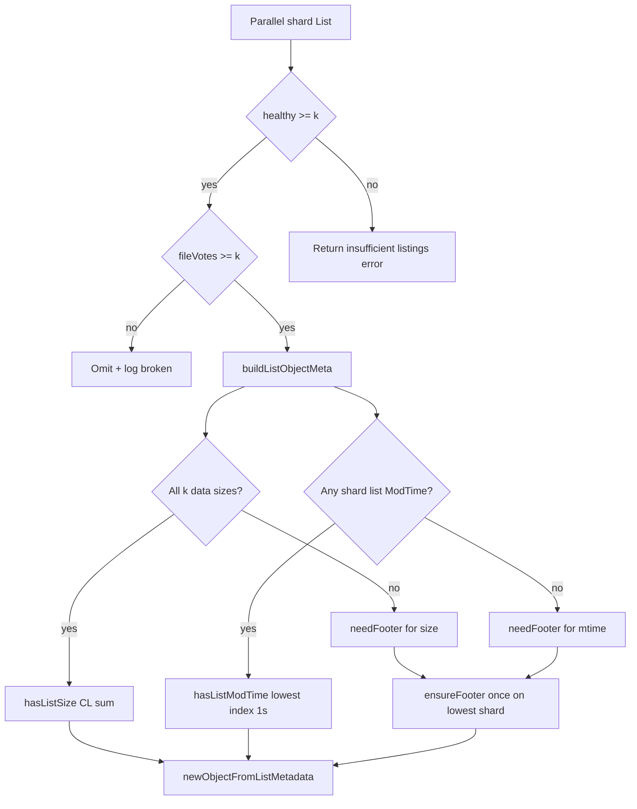

# RS listing: quorum merge and metadata

**Audience:** implementers and reviewers.  
**User-facing summary:** [`docs/content/rs.md`](../../../docs/content/rs.md) (Listing section).  
**Code:** [`list.go`](../list.go), [`list_metadata.go`](../list_metadata.go), [`object.go`](../object.go) (`ensureFooter`).  
**Tests:** [`list_metadata_test.go`](../list_metadata_test.go).  
**Last updated:** 2026-06-11

## Overview

`Fs.List` runs **parallel** `List` on every shard remote, merges names by **read quorum**
**k** (`readQuorum()` = `data_shards`), and builds `*Object` entries without reading a
footer when shard list metadata is enough.

Goals:

- Avoid per-file `readFooterFromParticle` on the hot list path when virtual-padding sizes
  and shard ModTimes are available.
- Keep listing consistent with Reed–Solomon reconstructability (**k** shards).
- Leave writes and namespace mutations on **`write_quorum`** (default **k+1**).

## Read vs write quorum

| Layer | Threshold | Notes |
|-------|-----------|-------|
| Directory listing | `healthy >= k` | Count of shards that listed the dir successfully (or `ErrorDirNotFound`) |
| File name vote | `fileVotes >= k` | Shards that listed the name as a **file** |
| Directory name vote | `dirVotes >= k` | Shards that listed the name as a **directory** |
| Broken file | `fileVotes < k` | Omit from output; log; **no** footer read |
| Write path | `write_quorum` (default **k+1**) | Put, Remove, SetModTime, Copy/Move/DirMove, mkdir/rmdir, … |
| Degraded / healthy | `present_shards >= k` | `backend degraded` inspection |

**Rationale:** list and reconstruct when **k** fragments exist; commit writes when at least
**k+1** shards succeed so one redundancy shard is usually present.

## List pipeline

1. **Parallel shard `List`** — [`list.go`](../list.go); per-shard errors are logged unless
   cancel/deadline.
2. **Vote merge** — per remote: `fileVotes`, `dirVotes`, per-shard file flags, sizes,
   ModTimes ([`mergedEntryVotes`](../list_metadata.go)).
3. **Directory gate** — `healthy < k` → return error.
4. **Per-name resolution** — sorted remote names:
   - type conflict (file + dir) → log, omit unless one side reaches quorum
   - `fileVotes < k` → log broken, omit
   - `fileVotes >= k` → [`buildListObjectMeta`](../list_metadata.go) →
     [`newObjectFromListMetadata`](../list_metadata.go)
   - `dirVotes >= k` (and not file quorum) → `fs.NewDir`

## Size resolution

Uses **virtual padding** (SYMM, footer v1). Logical content length from list sizes:

```text
CL = Σ(i=0..k−1) (listParticleSize_i − FooterSize)
```

Implemented in [`resolveListSize`](../list_metadata.go) →
[`ContentLengthFromDataShardPayloads`](../payloadlayout.go).

| Condition | Result |
|-----------|--------|
| All **k** data shards `0..k−1` list the file with `size >= FooterSize` | `hasListSize = true`, **no** footer |
| `fileVotes >= k` but any data shard missing or size too small | `needFooter = true` (footer supplies size) |
| `fileVotes < k` | Object **omitted** (handled in `list.go` before metadata build) |

Parity shard sizes do **not** participate in the sum. Size resolution does **not** depend on
ModTime.

## ModTime resolution

| Layer | Behavior |
|-------|----------|
| **Put / heal** | Footer `Mtime` (nanoseconds); logical `Fs.Precision()` = **1s**; source truncated on write |
| **List (provisional)** | Per-shard list ModTime truncated to **1s** in [`recordShardFileEntry`](../list_metadata.go) |
| **Pick** | [`resolveListModTime`](../list_metadata.go): lowest shard index among listing shards that expose ModTime |
| **Skew** | If two shard times differ by **> 1s**, `fs.Logf` skew warning; still use lowest index — **no** footer read |
| **Unavailable** | No shard exposes ModTime (`ModTimeNotSupported` or none listed) → `needFooter = true` |
| **After Open / Hash / SetModTime** | [`ensureFooter`](../object.go): footer ns mtime is authoritative |

## Footer coalescing

[`buildListObjectMeta`](../list_metadata.go) sets `needFooter` when **either** size or
ModTime cannot be resolved from list metadata.

[`newObjectFromListMetadata`](../list_metadata.go) calls [`ensureFooter`](../object.go) once
on **`primaryIndex`** = lowest shard index that listed the file
([`lowestListingShard`](../list_metadata.go)). That matches `NewObject`’s lowest-index
convention.

Mtime skew alone does **not** set `needFooter`.

Provisional fields on `*Object`: `hasListSize`, `listSize`, `hasListModTime`, `listModTime`.
`Size()` / `ModTime()` use list values until a footer is loaded.

## Decision flow



## Worked examples

**Listed at k, size from list (fast path)**  
`k=3`, `write_quorum=3`, all data shards list `fast.bin` with correct virtual-padding
sizes → `List` returns size and ModTime with `obj.footer == nil`.
(`TestListMetadataFastPathNoFooter`)

**Listed at k, footer for size**  
`k=3`, data shard 0 missing, parity shards still list the name (`fileVotes >= k`) → object
listed; `ensureFooter` loads size from footer on lowest listing shard.
(`TestListMetadataFooterFallbackMissingDataShard`)

**Not listed (broken)**  
`k=3`, only two shards list the file (`fileVotes < k`) → omitted, empty list entry set.
(`TestListOmitsBrokenBelowReadQuorum`)

**Parity-only votes, footer for size**  
`k=2`, `m=4`, three parity shards list the file, zero data shards → `fileVotes=3 >= k` →
listed; size requires footer (data-shard sum impossible).

## Direct lookup vs list

**`NewObject`** ([`list.go`](../list.go)) is not the list path: it probes shards in
parallel and picks the **lowest** index with a valid footer. List avoids that probe when
metadata from `List` suffices.

## Related docs

- Virtual padding layout: [`payloadlayout.go`](../payloadlayout.go), [`rs.md`](../../../docs/content/rs.md) (File formats)
- Open follow-ups: [`OPEN_QUESTIONS.md`](OPEN_QUESTIONS.md) (listing skew, S3/MinIO visibility)
