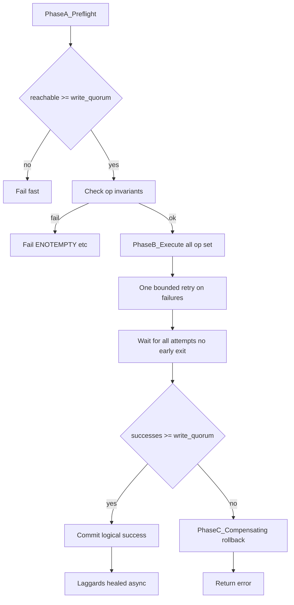

# RS quorum transactions (reference spec)

**Status:** Normative target for Phases 1–3 implementation. Documents decided policy; code may lag (see [Implementation status](#implementation-status)).  
**Audience:** implementers and reviewers.  
**User-facing summary:** [`docs/content/rs.md`](../../../docs/content/rs.md) (Quorum section).  
**Related:** [`LIST_METADATA.md`](LIST_METADATA.md) (list/read at **k**), [`OPEN_QUESTIONS.md`](OPEN_QUESTIONS.md), plan `rs_quorum_transactions_89147247.plan.md`.  
**Last updated:** 2026-06-13

## Overview

The `rs` backend spreads each logical path across **k+m** independent backing remotes. There is **no** central metadata service and **no** separate namespace metadata objects—directory and file presence come from **per-shard** `List` / `Mkdir` / `Rmdir` / `DirMove` / particle `Put` / `Remove`, merged at quorum thresholds.

Because generic remotes (S3, local, …) lack multi-key atomicity, writes use **compensating rollback** on failed commit, not distributed transactions. After a **successful** quorum commit, minority **laggard** shards are converged by **`backend heal`** (async heal)—the client does not wait for all k+m shards.

External precedent (MinIO, Swift, Tahoe): quorum commit + background repair. HDFS/CephFS-style inode metadata planes are **rejected** for rs (see [Rejected approaches](#rejected-approaches)).

---

## Terms

| Term | Meaning |
|------|---------|
| **k** | `data_shards` — minimum shards to reconstruct or list-merge a name |
| **m** | `parity_shards` |
| **write_quorum** | Minimum shard successes to **commit** a write (default **k+1**, range k..k+m) |
| **readQuorum** | **k** — floor for list merge, reconstruct, degraded “healthy” |
| **Commit** | Logical operation succeeds from the client’s perspective |
| **Compensating rollback** | After failed commit, undo successful shard side-effects (best-effort `Remove` / `Mkdir` / inverse move) |
| **Skew** | Shards disagree (missing dir, orphan particle, stale path) |
| **Laggard shard** | Shard that did not participate in a **committed** write; healed later |
| **Preflight cohort** | Shards reachable in phase A (must be `>= write_quorum` to proceed) |
| **Op set** | Shard indices targeted in phase B (usually all **0..k+m−1**, or `hadDir` for rmdir) |
| **Async heal** | Post-commit repair of laggards via `rclone backend heal` / degraded workflow—not part of the mutating request |

---

## Quorum floors

| Layer | Threshold | Operations |
|-------|-----------|------------|
| Read / reconstruct | **k** | `Open`, reconstruct, RS math |
| List / merge | **k** | `List`, `fileVotes` / `dirVotes`, omit broken `< k` |
| Degraded / healthy | **k** | `backend degraded` inspection |
| Write / namespace | **write_quorum** (default **k+1**) | `Put`, `Remove`, `SetModTime`, `Mkdir`, `Rmdir`, `Copy`, `Move`, `DirMove` |

**Topology:** **k > m** required (v1 policy)—prevents two disjoint k-subsets holding forked versions of the same path. See [`OPEN_QUESTIONS.md`](OPEN_QUESTIONS.md).

### WriteID guard (torn / mixed-write reads)

Each successful `Put` generates one random 64-bit **`WriteID`** (`crypto/rand`) and writes it to every shard footer for that encode. **Read** and **`backend heal`** share [`probeAndSelectWriteIDGroup`](../object.go):

1. Probe all **k+m** shards; keep layout-compatible particles (matching `ContentLength`, k, m, `StripeSize`, `NumStripes`, `Algorithm`, `CurrentShard`).
2. Group survivors by **`WriteID`**.
3. Select the **unique** group with **≥ k** members (unambiguous because **k > m** ⇒ at most one group can reach k).
4. **Read:** join data shards only when the winning group holds all **k** data shards; otherwise RS-reconstruct from any k shards in that group (parity participates). If no group reaches k → `errWriteIDSkew` (needs heal), never cross-group join.
5. **Heal:** rewrite every shard **outside** the winning group with reconstructed payload + the winner's **`WriteID`**.

Footer v1 was redefined in place (`FooterSize` 96 → 104); pre-production particles without **`WriteID`** fail parse.

---

## Transaction phase model

Every mutating operation follows three phases:



### Phase A — Preflight (read-only)

1. Determine **reachable** shards (parallel lightweight probe, e.g. `List` parent or root).
2. **Fail** if `len(reachable) < write_quorum` (log unreachable shards).
3. Operation-specific invariants (existence, emptiness, conflicts)—see [Per-operation spec](#per-operation-spec).

Preflight rules are **the same availability bar** for `Mkdir`, `Rmdir`, and `DirMove` (unlike today’s `Rmdir`, which aborts on any single-shard `List` error).

### Phase B — Execute (mutate)

1. Run the shard operation on **every index in the op set** in parallel.
2. **One bounded retry** on shards that failed in pass 1 ([`runTwoPhaseQuorumOp`](../rs.go)).
3. **No early exit** when `write_quorum` successes are observed—wait for **all** attempts (and retries) to finish.

**Rationale:** maximize convergence per request; record per-shard outcomes for logging, rollback, and heal.

### Phase C — Commit or rollback

| Outcome | Behavior |
|---------|----------|
| `successes >= write_quorum` | **Commit** — return success; log failures; laggards → async heal |
| `successes < write_quorum` | **Rollback** — compensating ops on shards that succeeded; return error |

Rollback honors the existing **`rollback`** config option (default `true`), extended beyond `Put` in Phases 1–3.

If rollback partially fails, return error and treat namespace as **degraded**—use `backend degraded` + `heal`.

---

## Namespace model

**Authority:** physical state on each backing remote at the same logical path prefix.

- **Files:** RS particles + 104-byte footer per shard ([`footer.go`](../footer.go)). Each `Put` stamps every shard with a shared random **`WriteID`** nonce (v1 layout) so reads and heal never join particles from different writes.
- **Directories:** directory markers / prefixes on each shard via `Mkdir` (not a separate rs metadata object).

**List** merges shard `List` results at **k** ([`LIST_METADATA.md`](LIST_METADATA.md)).

**Convergence:** after quorum commit, `backend heal` and (Phase 4b) namespace repair in `degraded` align minority shards—no inode overlay.

---

## Per-operation spec

Columns: **Preflight** → **Execute (op set)** → **Commit** → **Rollback** → **Async heal**.

### Put (object data)

| Phase | Spec |
|-------|------|
| Preflight | Writable remotes `>= write_quorum` ([`ensurePutWriteQuorum`](../operations.go)) |
| Execute | `Put` particle on all k+m shards; no early exit |
| Commit | `successes >= write_quorum` + size validation |
| Rollback | `Remove` uploaded particles on successes (**implemented**) |
| Heal | Re-upload missing shards for committed objects |

### Mkdir

| Phase | Spec |
|-------|------|
| Preflight | `reachable >= write_quorum`; path must not exist as **file** on quorum-visible merge (list at k or per-shard check) |
| Execute | `Mkdir` on all k+m shards |
| Commit | `successes >= write_quorum` |
| Rollback | `Rmdir` on shards where `Mkdir` succeeded |
| Heal | `Mkdir` on laggard shards |

### Rmdir

| Phase | Spec |
|-------|------|
| Preflight | `reachable >= write_quorum`; for each **reachable** shard that **has** `dir`, `List(dir)` must be **empty** (no children). Unreachable shards: logged; fail only if `reachable < write_quorum`. Shards with `DirNotFound`: skipped (not in op set). |
| Execute | `Rmdir` on **hadDir** (shards that had the directory in preflight), or all reachable shards that had dir—all parallel, no early exit |
| Commit | `successes >= write_quorum` among attempted rmdirs |
| Rollback | `Mkdir` on shards where `Rmdir` succeeded |
| Heal | `Rmdir` on laggard shards; remove orphan particles under removed logical dirs (Phase 4b) |

**Emptiness note:** emptiness is judged on the **preflight cohort** (reachable shards that list the dir), not “every shard in the cluster must answer.” A minority unreachable shard may still hold orphans; heal must converge. Logical `List` at parent may hide orphans when `fileVotes < k`.

### DirMove

| Phase | Spec |
|-------|------|
| Preflight | `reachable >= write_quorum`; `src` exists as directory on **≥ write_quorum** reachable shards; `dst` absent on those shards |
| Execute | Per-shard `Features().DirMove` on all k+m shards |
| Commit | `successes >= write_quorum` |
| Rollback | Inverse `DirMove` on successes where backend supports it; else log + degraded (S3)—no metadata tombstones |
| Heal | Align directory trees on laggard shards (Phase 4b) |

### Copy / Move (server-side)

Overwrite uses a **two-phase temp + backup + swap** so a pre-existing destination is not destroyed before new data is committed ([`move_copy.go`](../move_copy.go), [`move_copy_swap.go`](../move_copy_swap.go)):

1. **Phase 1 — temps (dst untouched):** per-shard server-side `Copy` of `src → {remote}.rs-tmp-{nonce}`. **Move** uses copy-to-temp only (source particles remain until commit).
2. **Phase 2 — swap:** per shard, back up old dst to `{remote}.rs-bak-{nonce}` when present, then install temp → dst (local: rename; S3/MinIO: `CopyObject` overwrite + delete temp). Per-shard install failure restores from backup inline; quorum rollback restores successful shards from backup.
3. **Commit:** delete `.rs-bak-*` / `.rs-tmp-*` staging paths; for **Move**, quorum-`Remove` source particles.

| Phase | Spec |
|-------|------|
| Preflight | Compatible `*rs.Fs` layout; `reachable >= write_quorum` |
| Phase 1 | Per-shard `Copy` to `.rs-tmp-*`; rollback removes temps only |
| Phase 2 | Backup dst → `.rs-bak-*`, install temp → dst; rollback restores dst from backup |
| Commit | `successes >= write_quorum` on each phase; staging cleanup; Move removes src |
| Return | Provisional `*Object` with source logical size/ModTime metadata — no destination footer read ([`newObjectAfterCopyMove`](../object.go)) |
| Heal | Object heal for particle skew; [`healCopyMoveArtifacts`](../move_copy_heal.go) purges `.rs-tmp-*` and restores or purges `.rs-bak-*` after a crash mid-swap (no central transaction log — in-process rollback covers normal failures) |

On ModTime-capable shard backends (local, MinIO), server-side copy/move preserves shard ModTime; returned metadata matches destination shards. S3 may not preserve ModTime on copy — see [`OPEN_QUESTIONS.md`](OPEN_QUESTIONS.md) Q14.

### Remove (object)

| Phase | Spec |
|-------|------|
| Preflight | `reachable >= write_quorum` (optional explicit check) |
| Execute | `Remove` particle on all k+m shards |
| Commit | `successes >= write_quorum` |
| Rollback | **Irreversible** — only “abort before delete”; no restore of deleted bytes without reconstruct from other shards |
| Heal | N/A for deleted content; ensure delete propagated to laggards |

### SetModTime

| Phase | Spec |
|-------|------|
| Preflight | `reachable >= write_quorum` |
| Execute | Per shard with object: `Object.SetModTime` (1s) when backend exposes ModTime; else footer `Mtime` rewrite via `updateShardFooterMtime` (fallback) |
| Commit | `successes >= write_quorum`; update in-memory `listModTime` on logical object |
| Rollback | Inverse per shard: prior remote ModTime or prior footer `Mtime` (**implemented**) |
| Heal | Converge remote ModTime and/or footer mtime on laggards (see Phase 5 heal policy) |

Logical `ModTime()` reads shard remote ModTime when backends support it; footer `Mtime` is authoritative only on `ModTimeNotSupported` backends. See [`LIST_METADATA.md`](LIST_METADATA.md) and [`OPEN_QUESTIONS.md`](OPEN_QUESTIONS.md) Q17.

---

## Successful commit vs async heal

On **commit**:

- The logical operation **succeeds** when `successes >= write_quorum`, even if fewer than k+m shards participated.
- Failed shard attempts are **logged**.
- The client **does not** wait for remaining shards.

**After commit**, minority shards may be stale or missing the change. Operators use:

```bash
rclone backend degraded rs:
rclone backend heal rs: [path]
```

This matches MinIO/Swift “quorum write, background repair to full layout.”

---

## Recovery

| Situation | Action |
|-----------|--------|
| Commit failed, rollback OK | User retries operation |
| Commit failed, rollback partial | `degraded` inspect; manual or `heal` |
| Commit OK, laggards | `heal` (expected normal case under flaky remotes) |
| Orphan particles, dir skew | `degraded` + namespace heal (Phase 4b) |

---

## Rejected approaches

### Separate metadata records (inode / dirent objects)

Perplexity and HDFS/CephFS use a **metadata authority** (NameNode, MDS, container DB). A proposed Track B stored JSON dirent/inode objects as extra rs files under reserved paths.

**Rejected:** rs namespace stays on **per-shard backing remotes** only. No `.rs/meta/...` particles, no tombstone metadata objects. Rationale: user decision; avoid second on-disk format and migration; accept documented limits under skew + heal.

### Early exit at write_quorum

**Rejected:** stop after N successes without trying remaining shards. We try **all** op-set targets, then commit.

### Require all k+m for commit

**Rejected** on unreliable generic remotes (Perplexity anti-pattern). Commit at `write_quorum` only.

### All-shard strict rmdir (current interim code)

**Rejected as target:** aborting `Rmdir` when **any** shard is down, or requiring orphans on **any** shard to block delete regardless of reachability. Replaced by preflight cohort + `write_quorum` availability (Phases 2–3).

---

## Worked examples

### Example 1 — Mkdir with one shard down (k=4, m=2, write_quorum=5)

- Shards 0–4 reachable, shard 5 down → preflight OK (`reachable=5`).
- `Mkdir` succeeds on 5 shards, fails on shard 5.
- **Commit** (5 ≥ 5). Client sees success.
- **Heal** later creates dir on shard 5.

### Example 2 — Mkdir commit failure + rollback

- `Mkdir` succeeds on 4 shards, fails on 2 → 4 < 5.
- **Rollback:** `Rmdir` on the 4 successes (best-effort).
- Return error `mkdir quorum not met`.

### Example 3 — Rmdir preflight (target)

- `mydir` exists on shards 0–2; shard 5 down; shards 3–4 never had `mydir`.
- `reachable=5` → preflight OK.
- Shards 0–2 list empty; execute `Rmdir` on 0–2 (and optionally 3–4 if dir appeared—spec: **hadDir** only).
- If 3 rmdirs succeed: 3 < 5 → **rollback** `Mkdir` on 0–2, error.

Phase 2 enforces this: commit requires `successes >= write_quorum`; otherwise compensating `Mkdir` rollback runs.

### Example 4 — Orphan on unreachable minority shard

- Logical `rmdir mydir` commits after quorum empty check on reachable cohort.
- Shard 5 was down and still has `mydir/orphan.txt`.
- Logical list may not show orphan; **heal** removes stray keys when shard 5 returns.

### Example 5 — DirMove partial success

- 5 of 6 shards `DirMove` OK → commit.
- Shard 5 still has old `srcdir` → heal / degraded reports directory skew.

---

## Implementation status

| Area | Spec phase | Code status |
|------|------------|-------------|
| Put rollback | — | **Done** |
| Execute all, no early exit | — | **Done** (`runTwoPhaseQuorumOp`) |
| Shared transaction framework | Phase 1 | **Done** ([`quorum_op.go`](../quorum_op.go): `preflightReachableShards`, `runQuorumTransaction`, `runCompensatingRollback`; Put preflight via `checkWriteQuorumAvailable`) |
| Rmdir alignment | Phase 2 | **Done** ([`rs.go`](../rs.go) `Rmdir` via `preflightReachableShards`, `rmdirPreflightHadDir`, `runQuorumTransaction` with `Mkdir` rollback) |
| Mkdir / DirMove preflight + rollback | Phase 3 | **Done** ([`rs.go`](../rs.go) `Mkdir`; [`move_copy.go`](../move_copy.go) `DirMove`; [`quorum_op.go`](../quorum_op.go) `mkdirPreflight`, `dirmovePreflight`) |
| Copy / Move / Remove / SetModTime rollback | Phase 4a | **Done** ([`move_copy.go`](../move_copy.go) `Copy`/`Move`; [`object.go`](../object.go) `Remove`/`SetModTime`; `Remove` has no compensating rollback per spec) |
| Namespace heal in degraded | Phase 4b | **Done** ([`namespace_heal.go`](../namespace_heal.go): `degraded lsd`, `healNamespace`; [`commands.go`](../commands.go)) |

---

## External patterns (summary)

| System | Relevant pattern |
|--------|------------------|
| **MinIO** | Quorum write; lazy heal on read / `mc admin heal` |
| **Swift** | Proxy quorum; object-reconstructor repairs fragments |
| **Tahoe-LAFS** | `shares.happy` commit; repair later (no POSIX dirs on shards) |
| **HDFS / CephFS** | Strong dirs via metadata authority — **contrast only, not adopted** |

---

## Implementation references

- Two-phase quorum ops: [`rs.go`](../rs.go) (`runTwoPhaseQuorumOp`, `Mkdir`, `Rmdir`)
- Put rollback: [`operations.go`](../operations.go) (`rollbackPut`)
- Server-side copy/move: [`move_copy.go`](../move_copy.go)
- Object heal: [`commands.go`](../commands.go)
- List merge: [`list.go`](../list.go), [`LIST_METADATA.md`](LIST_METADATA.md)
