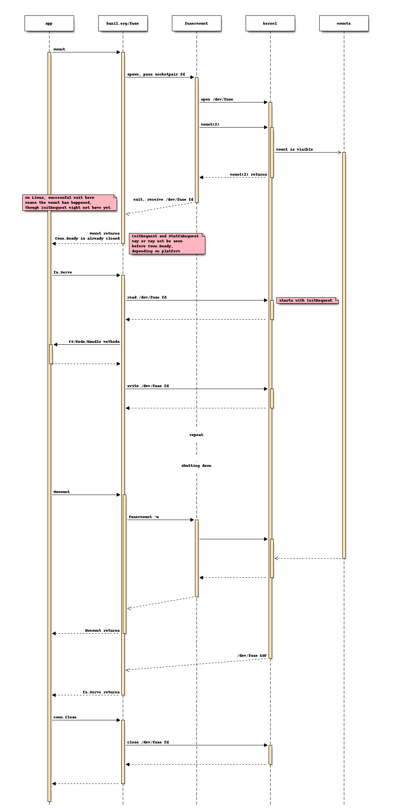
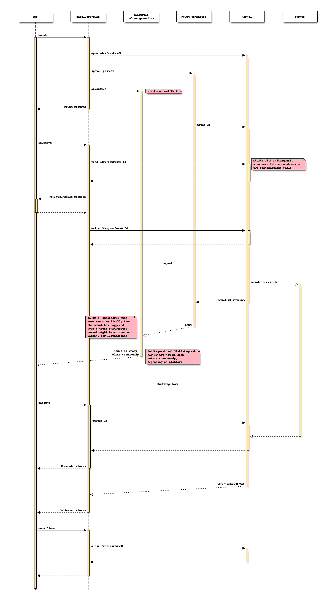
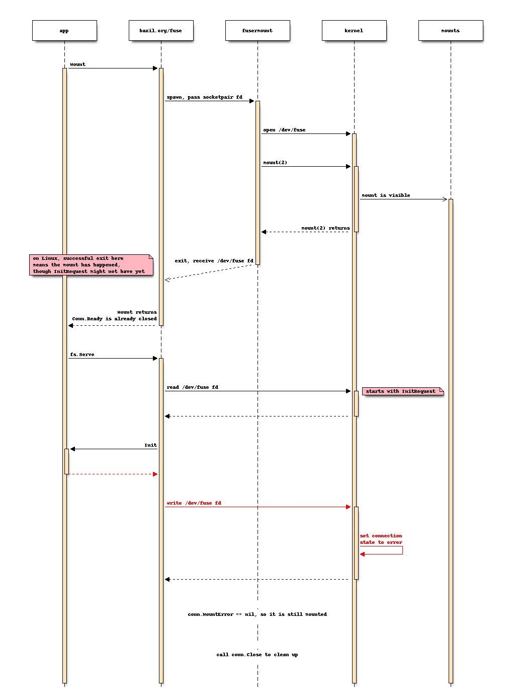
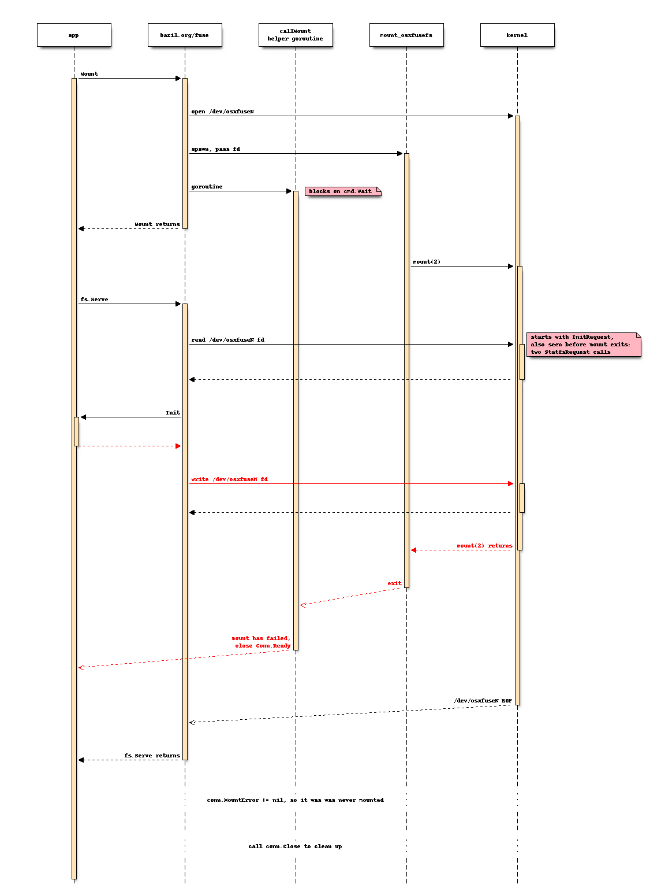

# The mount sequence

FUSE mounting is a little bit tricky. There's a userspace helper tool
that performs the handshake with the kernel, and then steps out of the
way. This helper behaves differently on different platforms, forcing a
more complex API on us.

## Successful runs

On Linux, the mount is immediate and file system accesses wait until
the requests are served.

On OS X, the mount becomes visible only after `InitRequest` (and maybe
more) have been served.

## Errors

Let's see what happens if `InitRequest` gets an error response. On
Linux, the mountpoint is there but all operations will fail:

On OS X, the mount never happened:

