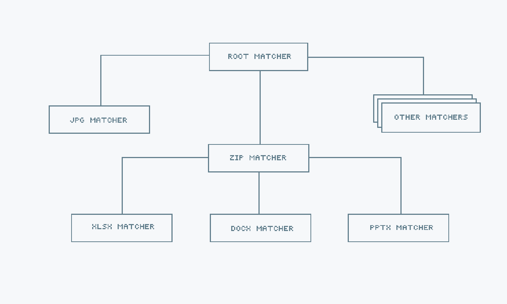

<h1 align="center">
  mimetype
</h1>

<h4 align="center">
  A package for detecting MIME types and extensions based on magic numbers
</h4>
<h6 align="center">
  No C bindings, zero dependencies and thread safe
</h6>

<p align="center">
  <a href="https://travis-ci.org/gabriel-vasile/mimetype">
    
  </a>
  <a href="https://godoc.org/github.com/gabriel-vasile/mimetype">
    
  </a>
  <a href="https://goreportcard.com/report/github.com/gabriel-vasile/mimetype">
    
  </a>
  <a href="https://coveralls.io/github/gabriel-vasile/mimetype?branch=master">
    
  </a>
  <a href="LICENSE">
    
  </a>
</p>

## Install
```bash
go get github.com/gabriel-vasile/mimetype
```

## Usage
There are quick [examples](EXAMPLES.md) and
[GoDoc](https://godoc.org/github.com/gabriel-vasile/mimetype) for full reference.

## Upgrade from v0.3.x to v1.x
In v1.x the detect functions no longer return the MIME type and extension as
strings. Instead they return a [MIME](https://godoc.org/github.com/gabriel-vasile/mimetype#MIME)
struct. To get the string value of the MIME and the extension, call the
`String()` and the `Extension()` methods.

In order to play better with the stdlib `mime` package, v1.x file extensions
include the leading dot, as in ".html".

In v1.x the `text/plain` MIME type is `text/plain; charset=utf-8`.

## Supported MIME types
See [supported mimes](supported_mimes.md) for the list of detected MIME types.
If support is needed for a specific file format, please open an [issue](https://github.com/gabriel-vasile/mimetype/issues/new/choose).

## Structure
**mimetype** uses an hierarchical structure to keep the MIME type detection logic.
This reduces the number of calls needed for detecting the file type. The reason
behind this choice is that there are file formats used as containers for other
file formats. For example, Microsoft Office files are just zip archives,
containing specific metadata files. Once a file a file has been identified as a
zip, there is no need to check if it is a text file, but it is worth checking if
it is an Microsoft Office file.

To prevent loading entire files into memory, when detecting from a
[reader](https://godoc.org/github.com/gabriel-vasile/mimetype#DetectReader)
or from a [file](https://godoc.org/github.com/gabriel-vasile/mimetype#DetectFile)
**mimetype** limits itself to reading only the first
[3072](https://github.com/gabriel-vasile/mimetype/blob/master/internal/matchers/matchers.go#L6)
bytes from the input.
<div align="center">
  
</div>

## Contributing
See [CONTRIBUTING.md](CONTRIBUTING.md).
