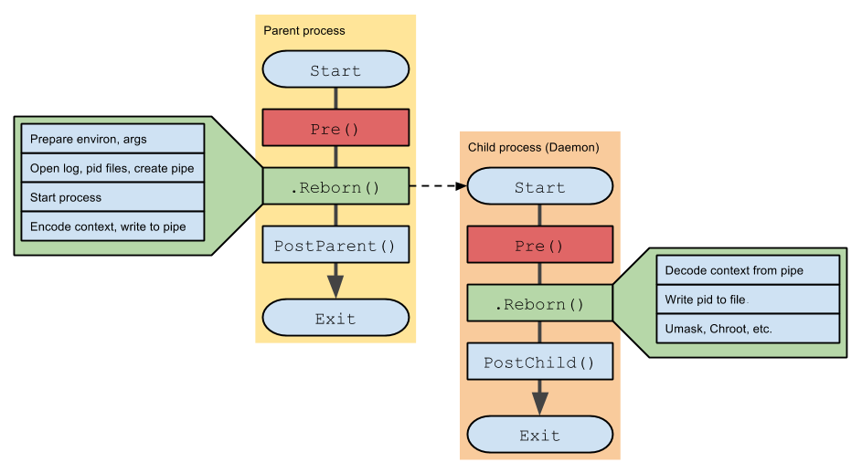

# go-daemon [](https://travis-ci.org/sevlyar/go-daemon) [](https://godoc.org/github.com/sevlyar/go-daemon)

Library for writing system daemons in Go.

Now supported only UNIX-based OS (Windows is not supported). But the library was tested only on Linux
and OSX, so that if you have an ability to test the library on other platforms, give me feedback, please (#26).

*Please, feel free to send me bug reports and fixes. Many thanks to all contributors.*

## Features

* Goroutine-safe daemonization;
* Out of box work with pid-files;
* Easy handling of system signals;
* The control of a daemon.

## Installation

	go get github.com/sevlyar/go-daemon

You can use [gopkg.in](http://labix.org/gopkg.in):

	go get gopkg.in/sevlyar/go-daemon.v0

If you want to use the library in production project, please use vendoring,
because i can not ensure backward compatibility before release v1.0.

## Examples

* [Simple](examples/cmd/gd-simple/)
* [Log rotation](examples/cmd/gd-log-rotation/)
* [Signal handling](examples/cmd/gd-signal-handling/)

## Documentation

[godoc.org/github.com/sevlyar/go-daemon](https://godoc.org/github.com/sevlyar/go-daemon)

## How it works

We can not use `fork` syscall in Golang's runtime, because child process doesn't inherit
threads and goroutines in that case. The library uses a simple trick: it runs its own copy with
a mark - a predefined environment variable. Availability of the variable for the process means
an execution in the child's copy. So that if the mark is not setted - the library executes
parent's operations and runs its own copy with mark, and if the mark is setted - the library
executes child's operations:

```go
func main() {
	Pre()

	context := new(Context)
	child, _ := context.Reborn()

	if child != nil {
		PostParent()
	} else {
		defer context.Release()
		PostChild()
	}
}
```


