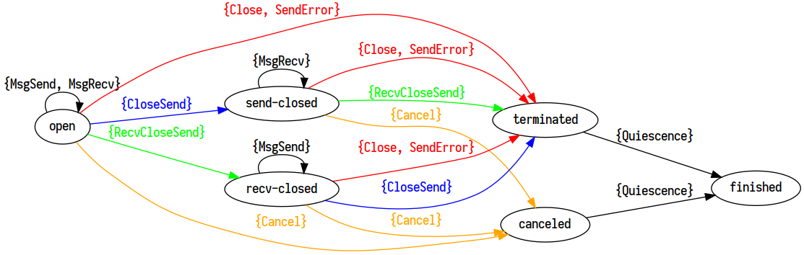

# package drpcstream

`import "storj.io/drpc/drpcstream"`

Package drpcstream sends protobufs using the dprc wire protocol.



## Usage

#### type Options

```go
type Options struct {
	// SplitSize controls the default size we split packets into frames.
	SplitSize int

	// ManualFlush controls if the stream will automatically flush after every
	// message send. Note that flushing is not part of the drpc.Stream
	// interface, so if you use this you must be ready to type assert and
	// call RawFlush dynamically.
	ManualFlush bool

	// MaximumBufferSize causes the Stream to drop any internal buffers that
	// are larger than this amount to control maximum memory usage at the
	// expense of more allocations. 0 is unlimited.
	MaximumBufferSize int

	// Internal contains options that are for internal use only.
	Internal drpcopts.Stream
}
```

Options controls configuration settings for a stream.

#### type Stream

```go
type Stream struct {
}
```

Stream represents an rpc actively happening on a transport.

#### func  New

```go
func New(ctx context.Context, sid uint64, wr *drpcwire.Writer) *Stream
```
New returns a new stream bound to the context with the given stream id and will
use the writer to write messages on. It is important use monotonically
increasing stream ids within a single transport.

#### func  NewWithOptions

```go
func NewWithOptions(ctx context.Context, sid uint64, wr *drpcwire.Writer, opts Options) *Stream
```
NewWithOptions returns a new stream bound to the context with the given stream
id and will use the writer to write messages on. It is important use
monotonically increasing stream ids within a single transport. The options are
used to control details of how the Stream operates.

#### func (*Stream) Cancel

```go
func (s *Stream) Cancel(err error) bool
```
Cancel transitions the stream into a state where all writes to the transport
will return the provided error, and terminates the stream. It is a no-op if the
stream is already finished, and returns a boolean indicating if that was the
case.

#### func (*Stream) Close

```go
func (s *Stream) Close() (err error)
```
Close terminates the stream and sends that the stream has been closed to the
remote. It is a no-op if the stream is already terminated.

#### func (*Stream) CloseSend

```go
func (s *Stream) CloseSend() (err error)
```
CloseSend informs the remote that no more messages will be sent. If the remote
has also already issued a CloseSend, the stream is terminated. It is a no-op if
the stream already has sent a CloseSend or if it is terminated.

#### func (*Stream) Context

```go
func (s *Stream) Context() context.Context
```
Context returns the context associated with the stream. It is closed when the
Stream will no longer issue any writes or reads.

#### func (*Stream) Finished

```go
func (s *Stream) Finished() <-chan struct{}
```
Finished returns a channel that is closed when the stream is fully finished and
will no longer issue any writes or reads.

#### func (*Stream) HandlePacket

```go
func (s *Stream) HandlePacket(pkt drpcwire.Packet) (err error)
```
HandlePacket advances the stream state machine by inspecting the packet. It
returns any major errors that should terminate the transport the stream is
operating on as well as a boolean indicating if the stream expects more packets.

#### func (*Stream) ID

```go
func (s *Stream) ID() uint64
```
ID returns the stream id.

#### func (*Stream) IsFinished

```go
func (s *Stream) IsFinished() bool
```
IsFinished returns true if the stream is fully finished and will no longer issue
any writes or reads.

#### func (*Stream) IsTerminated

```go
func (s *Stream) IsTerminated() bool
```
IsTerminated returns true if the stream has been terminated.

#### func (*Stream) MsgRecv

```go
func (s *Stream) MsgRecv(msg drpc.Message, enc drpc.Encoding) (err error)
```
MsgRecv recives some message data and unmarshals it with enc into msg.

#### func (*Stream) MsgSend

```go
func (s *Stream) MsgSend(msg drpc.Message, enc drpc.Encoding) (err error)
```
MsgSend marshals the message with the encoding, writes it, and flushes.

#### func (*Stream) RawFlush

```go
func (s *Stream) RawFlush() (err error)
```
RawFlush flushes any buffers of data.

#### func (*Stream) RawRecv

```go
func (s *Stream) RawRecv() (data []byte, err error)
```
RawRecv returns the raw bytes received for a message.

#### func (*Stream) RawWrite

```go
func (s *Stream) RawWrite(kind drpcwire.Kind, data []byte) (err error)
```
RawWrite sends the data bytes with the given kind.

#### func (*Stream) SendCancel

```go
func (s *Stream) SendCancel(err error) (bool, error)
```
SendCancel transitions the stream into the canceled state with context.Canceled
and sends a cancel error to the remote side for a soft cancel. It is a no-op if
the stream is already terminated. It returns true for busy if writes are already
blocked and a hard cancel is required.

#### func (*Stream) SendError

```go
func (s *Stream) SendError(serr error) (err error)
```
SendError terminates the stream and sends the error to the remote. It is a no-op
if the stream is already terminated.

#### func (*Stream) SetManualFlush

```go
func (s *Stream) SetManualFlush(mf bool)
```
SetManualFlush sets the ManualFlush option. It cannot be called concurrently
with any sends or receives on the stream. Example use case:

    flusher := stream.(interface{
        GetStream() drpc.Stream
    }).GetStream().(interface{
        SetManualFlush(bool)
    })

    flusher.SetManualFlush(true)
    err = stream.Send(&pb.Message{Request: "hello, "})
    flusher.SetManualFlush(false)
    if err != nil {
        return err
    }

    // the next send will send both messages in the same write
    // to the underlying connection.
    err = stream.Send(&pb.Message{Request: "world!"})
    if err != nil {
        return err
    }

#### func (*Stream) String

```go
func (s *Stream) String() string
```
String returns a string representation of the stream.

#### func (*Stream) Terminated

```go
func (s *Stream) Terminated() <-chan struct{}
```
Terminated returns a channel that is closed when the stream has been terminated.
